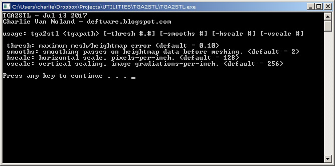
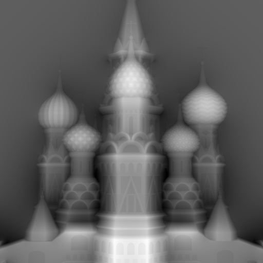
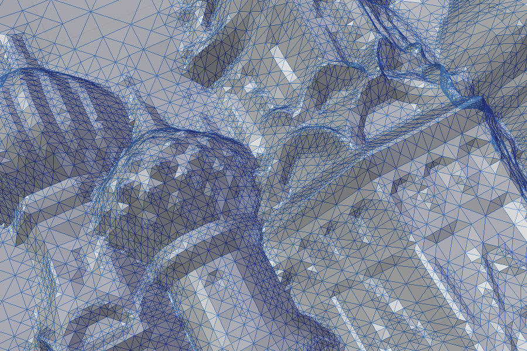
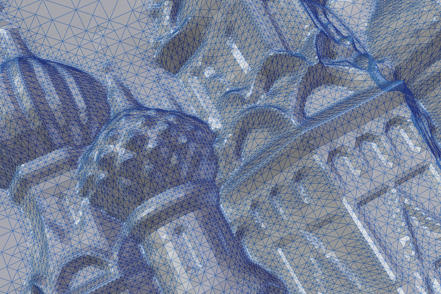
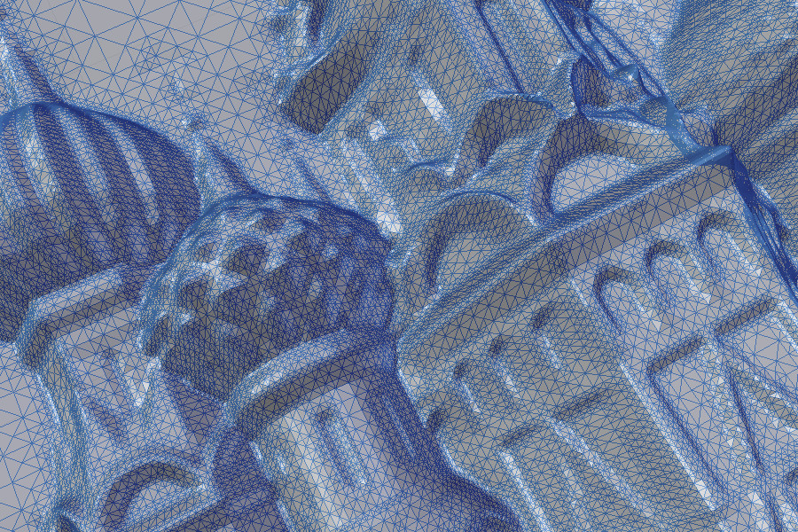

# TGA2STL
This is a stand-alone command-line utility that I spent a week or two writing at the beginning of 2016 and then completely forgot about. I stumbled across it by chance and decided it was in good enough shape to justify becoming my first github project :D

There are several depthmap/heightmap-to-mesh programs out there but the meshes that they output are cumbersome to work with. These programs strictly generate a grid of triangles with vertex heights dictated by input image pixel brightness. In contrast, TGA2STL starts with a coarse grid of triangles and subdivides them when they do not conform to the heightmap to within a threshold value. The end result is a mesh that is more friendly to 3D programs, such as CAM software, 3D printing model-slicers, and modeling/animation packages. By only creating smaller triangles where there is more detail and 'variance' the mesh uses only as many triangles as it needs to osculate the surface represented by the 2D depthmap.

 I had recently begun using Blender to create meshes from depthmaps for milling on my hobby CNC - and this was quite a chore for something you would think should not that complicated. I wish I had remembered that I wrote this program before I endured that learning curve! However, I plan to use TGA2STL for future CNC projects in combination with Blender's decimation modifier, because it does a really good job (albeit slowly) at evenly distributing the decimation where the degredation of the surface manifold approximation is evenly distributed.
 
 TGA2STL is very fast. It can generate 100k triangle meshes in a fraction of a second (less than 500ms) on a 3.5ghz machine. Many of the existing grid-based depthmap-to-mesh programs out there are extremely slow because of the language they're written in and/or because they generate huge unmanageable and unwieldy meshes with tons of triangles.

# Usage
Using TGA2STL is as easy as dragging and dropping your 24 or 32 bit TGA depthmap onto TGA2STL.EXE which will then popup a window showing details about the binary tree nodes and number of triangles generated. This will automatically generate a mesh using the default parameters. If you run TGA2STL by itself you will be presented with the command-line usage information:

'thresh' designates the threshold at which the mesh's deviation from the input image triggers a triangle subdivide.

'smooths' sets the number of simple 3x3 height value averages to perform across the input image data before generating the mesh. This helps to prevent extraneous subdivisions from occurring, minimizing triangle-count. However, this is at the expense of retaining detail in the final mesh.

'hscale' allows establishing how many pixels to each mesh unit. If you have a 512x512 image, for instance, and set hscale to 128 then the output mesh will be 4x4 model units. I personally interpret them as inches, and so hscale can be considered pixels-per-inch.

'vscale', similarly, establishes how many mesh units the RGB 0-255 range should span. The default is 256, thus the full range of an image's 0-255 color range is capable of generating a mesh with a vertical size of one mesh unit. If you want a shallower mesh then use a larger number. For a mesh that's 0.25 units tall you would use 1024, as the 0-255 range goes into 1024 four times, and is thus 0.25 x 1024.

I have created a triplet of batch files which you can also drag-drop your TGA depthmaps onto, each with a different threshold value. You can create your own batch files with your own custom parameters to do the same thing if the given ones don't suit your needs. If the mesh is too tall then add '-vscale XYZ' with XYZ replaced with a larger value than the default. If your depthmap is too noisy, making lots of little polygonal surface discontinuities, then use '-smooth XYZ' with an XYZ greater than the default 2 smooth passes. Conversely, if your mesh is coming out too smooth, then use a smaller number of smooths, or '0'. Etcetera.

# Example Output

Here's a 512x512 depthmap I've been using for testing. It is the input used for the following output mesh images. These are closeups for purposes of conveying the changes in mesh triangulation as the threshold value decreases.

This is the mesh generated from using a subdivide threshold of 0.25 with all other parameters at their defaults. (39k triangles)

Here's the mesh output with thresh set to 0.125. (78k triangles)

...and 0.0625. (135k triangles)

You can see that by halving the subdivision threshold value the output mesh triangle count doubles.

# Limitations and Requirements
There are some limitations as to what TGA2STL can work with insofar as the depthmap images themselves are concerned:

- Run-length encoded (RLE) Depthmap TGA files cannot be used. Only raw-format TGA images will be recognized by TGA2STL in its current form. The origin can, however, be top-left or bottom-left (some imaging programs like to default to either, which can make loading TGA's tricky).

- Depthmap dimensions must be a power of two. It *will* work with non-power-of-two dimensions, but you'll get a gross pixellated stair-stepping resultant mesh, which is a product of the nearest sampling of the depthmap data. With the addition of a linear interpolation, at the very least, this restriction would be resolved.

- Rectangular depthmaps (i.e. non-square) *do* work but the mesh division doesn't adapt to the image's aspect ratio to keep subdivisions square. The starting base triangle mesh is initialized to the input image dimensions, but divisions still occur at halfway points vertically and horizontally, and are not distributed based on the width/height ratio of the image. Not sure if this is something I'm interested in ever resolving. A temporary fix would be to take your rectangular depthmaps and add margins on the longer sides to make it square.

# Possible Feature Additions and Enhancements
This program is pretty much just as I originally wrote it. I tweaked a few parameters and the algorithm for sub-dividing triangles, but other than that this is virtually it's one and only incarnation. There are many things that can be done to improve it as a user application. Here are some of the ideas I've had, and they are in no particular order:

- Loading more than just TGA depthmap images, such as JPG, BMP, PNG, etc.. is an obvious one. I am not sure I will spend the time making this happen, and if I did it almost makes more sense to just copy the code base and make it load JPGs instead of TGAs, i.e. JPG2STL.

- Support larger images and bigger meshes with more triangles. This version of TGA2STL only allows meshes up to 64MB before it whines about an overflow. It also will only allow for meshes with up to 16 million triangles. I haven't calculated which comes first, 64MB or 16m triangles, but whatever is hit first will cause it to stop subdividing and/or outputting anymore triangles beyond whatever it achieved up to that point. The problem lies in that it statically allocates fixed-sized buffers to work inside of. This can be resolved by streamlining the whole program so that after it generates the binary tree of triangle subdivisions it directly writes each triangle to the STL mesh file, instead of dumping triangles to a buffer and then dumping those triangles to an STL file buffer, and then dumping that to disk.

- 3D preview with real-time parameter adjustment. This could almost take the form of just an external program that calls TGA2STL and re-loads the mesh each time a new one is spit out.

- Argument to designate the 'origin' of the mesh. Currently the origin lies at the bottom left corner of the mesh, which is really only standard for raster images and displays, but not CAM. I intend to add arguments for designating the XY position of the origin on the mesh as a 0.0-1.0 fraction of the mesh size. So for the origin to be in the center you would use an XY origin of *0.5,0.5* and that would be simple enough.

- Bilinear interpolation to allow for non-power-of-two images without the yucky terracing effect that nearest-neighbor causes during sampling at subdivision intervals.

- Create more intuitive scaling argument conventions. The vscale/hscale makes sense to me, but it might not be so clear to the next person. Perhaps the vscale argument should be inverted, so that it represents the number of brightness gradiations that fit into one mesh unit. In other words, instead of '-vscale 512' to make the mesh only 0.5 units tall, use '-vscale 0.5'. As for hscale, perhaps it could just be the number of mesh units for the width of the image, instead of mucking about with correlating the two as a ratio. Then if you wanted your 32x32 depthmap to be 10 mesh units wide, you could, easily.

